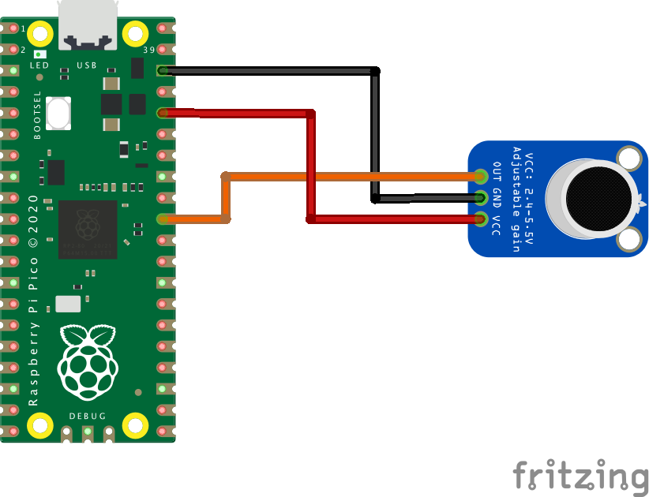
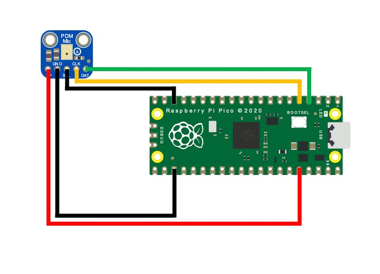
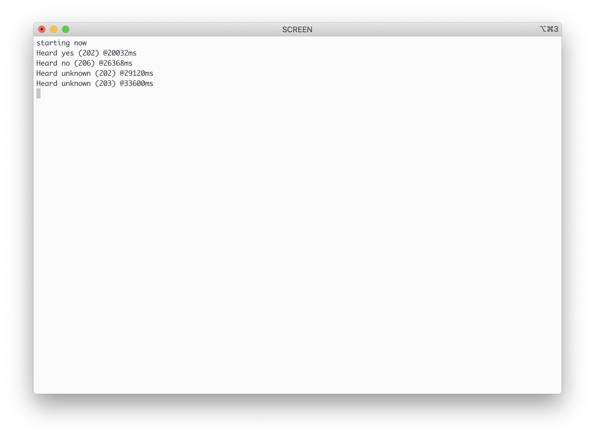

# TinyML Wake-Word Detection on Raspberry Pi Pico
Based on repo from https://www.hackster.io/hlsw/pico-wake-word-1e2372


This application implements the wake word example from
[Tensorflow Lite for Microcontrollers](https://www.tensorflow.org/lite/microcontrollers)
on the Raspberry Pi Pico.

The wake word example shows how to run a 20 kB neural network that can detect 2
keywords, "yes" and "no". More information about this example is available on
the [Tensorflow Lite Micro examples folder](https://github.com/tensorflow/tensorflow/tree/master/tensorflow/lite/micro/examples/micro_speech).

We use as input an electret microphone to detect the words "yes" or "no" and
turn the on-device LED on and off in response.

## Acknowledgements

This project was created on behalf of the
[Arm Software Developers](https://developer.arm.com/) team, follow them on
Twitter: [@ArmSoftwareDev](https://twitter.com/armsoftwaredev) and YouTube:
[Arm Software Developers](https://www.youtube.com/channel/UCHUAckhCfRom2EHDGxwhfOg)
for more resources!

### Pico Microphone

This project is dependant on the `pico-microphone` library by
[Sandeep Mistry](https://github.com/sandeepmistry).
Take a look [here](https://github.com/sandeepmistry/pico-microphone) for more
information about the library.

## Contents

- [Overview](#overview)
- [Before You Begin](#before-you-begin)
    - [Hardware Requirements](#hardware-requirements)
    - [Hardware Setup](#hardware-setup)
        - [Assembly](#assembly)
        - [Wiring](#wiring)
    - [Software Setup](#software-setup)
- [Wake-Word uf2 file](#wake-word-uf2-file)
- [Build Yourself](#build-yourself)
- [Making Your Own Changes](#making-your-own-changes)
- [Contributions](#contributions)
- [License](#license)

## Overview

The `micro_speech` app for the Raspberry Pi Pico is an adaptation taken from
the "Wake-Word" example on Tensorflow Lite for Microcontrollers. Pete Warden's
and Daniel Situnayake's _[TinyML](https://tinymlbook.com)_ book gives an
in-depth look into how this model works and how to train your own. This
repository ports the example to work on the Pico.

The application works by listening to the microphone and processing the data
before sending it the model to be analyzed. The application takes advantage of
Pico's ADC and DMA for the analog microphone and the Pico's PIO and DMA for the
PDM microphone to listen for samples, saving the CPU to perform the complex
analysis.

The Pico does not come with an onboard microphone. For this application, we use
the Adafruit Auto-gain Electret Microphone Amplifier breakout or the Adafruit
PDM MEMS Microphone Breakout.

## Before You Begin

We will now go through the setup of the project. This section contains three
sub-sections, hardware requirements, hardware setup and software setup.

### Hardware Requirements

#### Analog Microphone

- 1x [Raspberry Pi Pico](https://www.raspberrypi.org/products/raspberry-pi-pico/)
- 1x [Electret Microphone Amplifier - MAX9814 with Auto Gain Control](https://www.adafruit.com/product/1713)
- 1x Micro USB cable
- 3x Jumper wires
- 2x 1x20 male header pins (for the Pico)
- 1x 1x5 male header pins (for the microphone)

#### PDM Microphone

- 1x [Raspberry Pi Pico](https://www.raspberrypi.org/products/raspberry-pi-pico/)
- 1x [Adafruit PDM MEMS Microphone Breakout](https://www.adafruit.com/product/3492)
- 1x Micro USB cable
- 5x Jumper wires
- 2x 1x20 male header pins (for the Pico)
- 1x 1x5 male header pins (for the microphone)


### Hardware Setup

#### Assembly

1. Solder headers onto your Raspberry Pi Pico
2. Solder headers onto your Adafruit Electret Microphone

#### Wiring

The electret microphone breakout is an analog input, meaning we can connect it
to one of the ADC pins on the Raspberry Pi Pico. Make the following connections:

##### Analog Microphone

| __Adafruit Electret Microphone__ | __Raspberry Pi Pico__ |
|------------------------------|-------------------|
| OUT                          | ADC0 - Pin31      |
| GND                          | Any ground pin    |
| VDD                          | 3V3(OUT) - Pin36  |



#### PDM Microphone

| __Adafruit PDM Microphone__ | __Raspberry Pi Pico__ |
|------------------------------|-------------------|
| GND                          | Any ground pin    |
| SEL                          | Any ground pin    |
| VCC                          | 3V3(OUT) - Pin36  |
| DAT                          | GPIO2             |
| CLK                          | GPIO3             |



### Software Setup

The final step before using this application is to set up the software stack
(CMake and compilers). The easiest way to do this is to follow the steps on the
Raspberry Pi Pico SDK [repository](https://github.com/raspberrypi/pico-sdk).
Once done you can test your tolchain setup by running some of the examples
found in the Pico examples
[repository](https://github.com/raspberrypi/pico-examples).


You can now clone this repository.

```
git clone https://github.com/Navelwriter/TFLite-pico-wake-word
cd pico-wake-word
git submodule init
git submodule update
```

## Wake-Word uf2 file

The easiest way to get started on this application is to use the provided `.uf2`
file. Doing this means you will not have to build the application yourself. You
can download the `.uf2` [here](build/micro_speech.uf2). Click on download, and
your browser should start downloading a file called `micro_speech.uf2`.

To install this onto your Pico, you need to do the following:

1. Push and hold the BOOTSEL button and plug your Pico into the USB port of
your Raspberry Pi or another computer.
2. It will mount as a Mass Storage Device called RPI-RP2.
3. Drag and drop the `micro_speech.uf2` binary onto the RPI-RP2 volume.
4. Pico will reboot, and the built-in LED should start blinking.

You can access the output on your Pico by viewing the serial console. There are
many applications for this. Raspberry Pi recommends using `minicom`. However,
if you are on macOS, you can use the in-built `screen`.

You first need to find the name of your Pico.

On macOS:

```
ls /dev/cu*
```

On Linux:

```
ls /dev/tty*
```

Copy your device name (hint: if you are unsure which device is your Pico:
unplug your Pico, re-run the command and then plug your Pico back in, after
re-running the command once more, the new device will be your Pico) and then
run the following:


Using `screen`:

```
screen {device_name} 115200
```

Using `minicom`:

```
minicom -b 115200 -o -D {device_name}
```

You should now be able to see an output similar to the following:



## Build Yourself

With the Pico-SDK setup on your machine, building the application is the same as
building any other Pico application.

1. Change directory into this repository

    ```
    cd TFLite-pico-wake-word
    ```

2. Initialize the submodules

    ```
    git submodule init
    cd lib/pico-sdk
    git submodule init
    cd ../../
    ```

3. Make a build directory

    ```
    mkdir build
    ```

4. Generate the Makefiles

    ```
    cd build
    cmake ..
    ```

5. Finally run the Makefile

    ```
    make -j8
    ```

Once done, your `pico_micro_speech_analog.uf2` and `pico_micro_speech_pdm.uf2`
file is located in `build`.

## Making Changes

If you would like to use a different microphone, different LED, use other pins
on Pico or change the audio quality, you will need to know how to make these
changes to the application.

### Changing the LED

The LED settings can be found in `micro_speech/rp2/command_responder.cc`. To
change the LED to a different pin (instead of the onboard LED), change the line:

```cpp
#define LED_PIN 25
```

To change the functionality of the LED, edit the `if-else` section:

```cpp
if (found_command == "yes"){
  //turn led on
  gpio_put(LED_PIN, 1);
}
else if (found_command == "no"){
  //turn led off
  gpio_put(LED_PIN, 0);
}
```

### Changing the ADC

The ADC pin is defined in the `src/audio_provider.cc` script. To
change the pin used in the application, change the lines:

```cpp
#define ADC_PIN 26
#define CAPTURE_CHANNEL 0
```

### Changing the Audio Quality

You can change the audio quality captured in the application. By default, the
Tensorflow model expects a `16kHz` quality. `16kHz` means `16000` samples every
second. Below you can see the analog config in the `src/audio_provider.cc`
file.

```cpp
const struct analog_microphone_config config = {
    // GPIO to use for input, must be ADC compatible (GPIO 26 - 28)
    .gpio = ADC_PIN + CAPTURE_CHANNEL,

    // bias voltage of microphone in volts
    .bias_voltage = 1.25,

    // sample rate in Hz
    .sample_rate = 16000,

    // number of samples to buffer
    .sample_buffer_size = ADC_BUFFER_SIZE,
};
```

You can change the different settings to best suit your need.

## Contributions

There are possibly many ways to improve this work. Please feel free to make a
PR for any improvements made.

## License

This repository is licensed under Apache License 2.0. Tensorflow and
CMSIS-NN are also both licensed under Apache License 2.0, Pico-SDK is licensed
under BSD 3-Clause "New" or "Revised" License. For other libraries and packages
used in this repository, please find the licenses in the
`micro_speech/third_party` folder.
